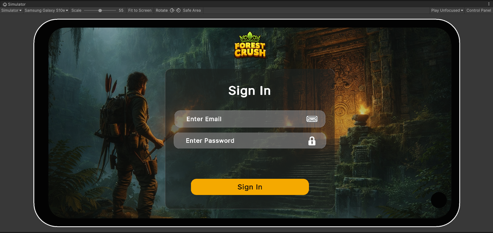
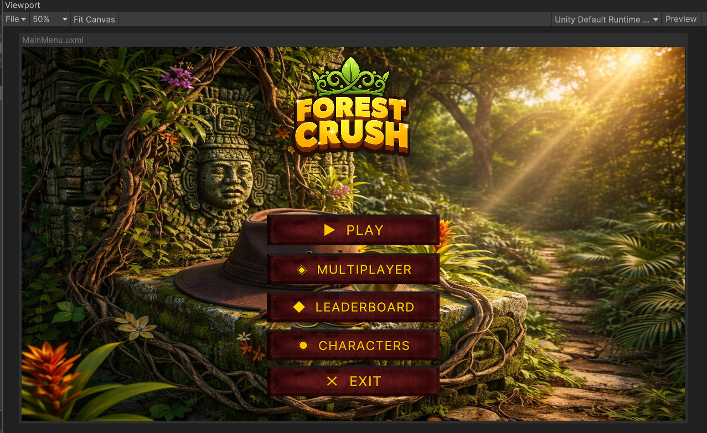
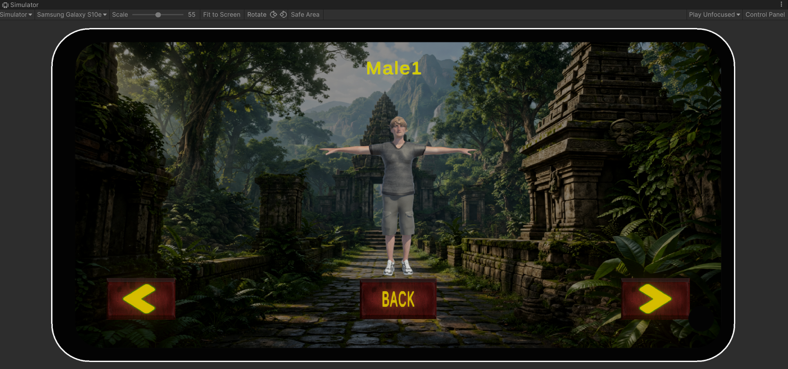
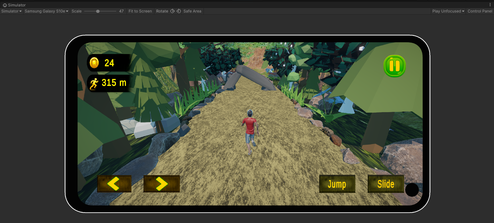
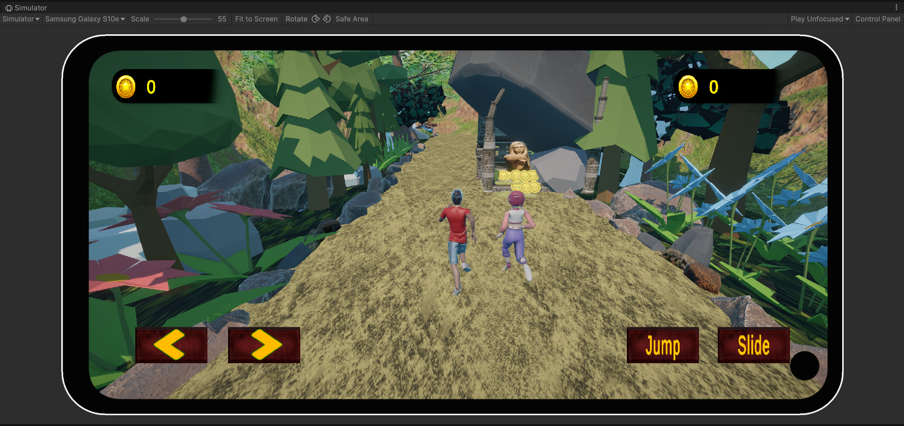
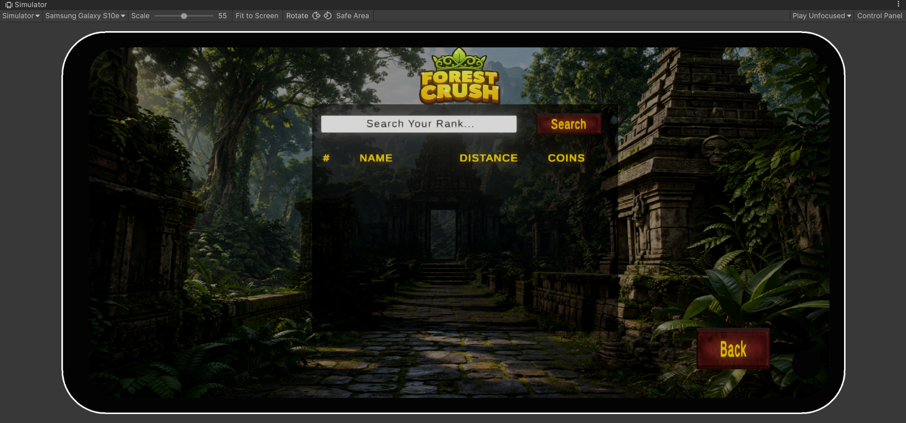

# 🌲 Forest Crush — 3D Endless Runner (Unity)

A complete 3D endless runner mobile game built in Unity — featuring both
**single-player and real-time multiplayer modes**, backed by a full cloud
infrastructure (PlayFab) and **Photon Fusion 2** networking. Developed
**solo** as a final year project.

---

## 📱 Screenshots

| Login | Main Menu | Character Select |
|---|---|---|
|  |  |  |

| Single Player | Multiplayer | Leaderboard |
|---|---|---|
|  |  |  |
---

## 🎮 Features

- **Single-player & Multiplayer** game modes, sharing a common core architecture
- **Real-time multiplayer** via Photon Fusion 2 — room/lobby system, matchmaking, synced countdown, networked player actions
- **PlayFab backend integration** — authentication, cloud-saved player data, and a live leaderboard
- **Leaderboard system** — Top 10 rankings, real per-player stats (no fake/estimated data), and a search feature to find your own rank if outside the Top 10
- **Custom UI** — login/auth flow built with Unity UI Toolkit, in-game menus with uGUI
- **Procedural level generation** — pattern-based hurdle & coin spawning
- **Character selection system** with live 3D preview
- **Signed, production-ready Android build**

---

## 🛠️ Tech Stack

| Category | Technology |
|---|---|
| Engine | Unity (URP) |
| Language | C# |
| Multiplayer | Photon Fusion 2 |
| Backend | PlayFab (Auth, Statistics, UserData) |
| UI | Unity UI Toolkit, uGUI |
| Platform | Android |

---

## 📂 Repository Structure

> This repository contains **selected showcase scripts** from the full
> project — highlighting core systems across networking, backend, and
> gameplay. Art assets, audio, and third-party packages are excluded
> (large file size / licensing).
